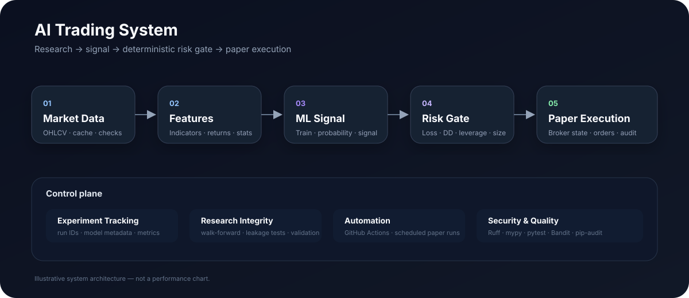

# AI Trading System

  <strong>Research-grade quantitative trading infrastructure with an AI signal engine, deterministic risk controls, backtesting, and automated paper execution.</strong>

  
  
  
  
  

  <a href="#-what-it-does">What it does</a> ·
  <a href="#-architecture">Architecture</a> ·
  <a href="#-paper-trading-agent">Agent</a> ·
  <a href="#-research--experiments">Research</a> ·
  <a href="#-quickstart">Quickstart</a> ·
  <a href="docs/">Dashboard</a>

> **Research / educational software.** This project is not financial advice and does not guarantee trading performance. Keep execution in paper mode until the strategy, infrastructure, and operational controls have been independently validated.

---

## ✦ What it does

**AI Trading System** is a modular Python platform for taking a quantitative research workflow from raw market data to a controlled paper-trading decision.

| Layer | Purpose |
|---|---|
| 📡 **Market data** | Fetch, validate, cache, and align OHLCV data |
| 🧮 **Feature engine** | Technical indicators, returns, volatility, and statistical features |
| 🧠 **ML signal engine** | Chronological model training and probability-based signals |
| 🧪 **Research engine** | Backtesting, walk-forward validation, baselines, and reproducible experiments |
| 🛡️ **Risk engine** | Daily-loss, drawdown, leverage, position-size, stale-data, and order controls |
| 🤖 **Trading agent** | Connects model decisions to broker state and execution rules |
| 📝 **Experiment ledger** | Run IDs, metrics, model metadata, feature importance, and summaries |
| ⚙️ **Automation** | GitHub Actions scheduled paper-trading cycles |
| 🔐 **Security** | CI quality gates, Bandit, pip-audit, CodeQL, Dependabot, secret separation |

---

## ◈ The system at a glance

~~~mermaid
flowchart LR
    A["📡 Market Data"] --> B["✓ Validation"]
    B --> C["🧮 Feature Engineering"]
    C --> D["🧠 ML Predictor"]
    D --> E["🎯 Signal"]
    E --> F{"🛡️ Risk Gate"}
    F -->|Allowed| G["🤖 Paper Broker"]
    F -->|Blocked| H["⛔ No Order"]
    G --> I["📋 Execution State"]
    I --> J["📊 Logs / Experiments"]

    C -.-> K["🧪 Backtester"]
    D -.-> K
    K --> L["📈 Metrics"]

    J --> M["🔍 Monitoring"]
    L --> M
~~~

### Decision lifecycle

~~~mermaid
sequenceDiagram
    participant Data as Market Data
    participant Model as ML Engine
    participant Risk as Risk Gate
    participant Broker as Paper Broker
    participant Log as Experiment Log

    Data->>Model: validated OHLCV + features
    Model->>Model: train chronologically
    Model->>Risk: probability → signal
    Risk->>Risk: loss / drawdown / leverage / size / freshness
    alt risk allowed
        Risk->>Broker: submit controlled order
        Broker-->>Risk: broker state
    else risk blocked
        Risk-->>Model: no order
    end
    Risk->>Log: decision + run metadata
~~~

---

## ⚡ Quickstart

### 1. Clone

~~~bash
git clone https://github.com/abelmiracle377-stack/trade-bot-system.git
cd trade-bot-system
~~~

### 2. Create an isolated environment

~~~bash
python -m venv .venv
source .venv/bin/activate          # Windows: .venv\\Scripts\\activate
python -m pip install --upgrade pip
python -m pip install -r requirements-lock.txt
python -m pip check
~~~

### 3. Build and test

~~~bash
python -m build
python -m pytest tests/ -v --cov=src --cov-report=term-missing --cov-fail-under=65
~~~

Or:

~~~bash
make ci
~~~

### 4. Run the research pipeline

~~~bash
python main.py
~~~

---

## 🤖 Paper-trading agent

The execution layer is deliberately **paper-first**.

A single agent cycle:

~~~text
Account state
     │
     ▼
Market data → validation → features → model
                              │
                              ▼
                       latest probability
                              │
                              ▼
                       trading signal
                              │
                              ▼
                       deterministic risk
                         ┌────┴────┐
                         │         │
                       allow     block
                         │         │
                         ▼         ▼
                    paper order   no order
~~~

Run locally:

~~~bash
export ALPACA_API_KEY="your-paper-key"
export ALPACA_API_SECRET="your-paper-secret"

python scripts/run_trading_agent.py
~~~

The agent reads broker equity and position state, evaluates the latest model signal, applies hard risk limits, and only then considers an order.

### Automated runs

GitHub Actions can execute the agent on weekdays and can also be started manually.

Workflow:

**.github/workflows/trading-agent.yml**

Required repository secrets:

- **ALPACA_PAPER_API_KEY**
- **ALPACA_PAPER_API_SECRET**

The workflow explicitly sets:

~~~text
ALLOW_LIVE_TRADING=NO
~~~

It also uploads run logs and runtime state as artifacts for inspection.

> **Important:** a scheduled workflow is not the same thing as a continuously running process. Each invocation runs one agent cycle and exits.

---

## 🛡️ Risk controls

The model does not directly control execution.

The execution path is gated by deterministic controls including:

- maximum daily loss
- maximum drawdown
- maximum portfolio leverage
- maximum position / order notional
- stale market-data protection
- duplicate open-order protection
- minimum order notional
- prospective exposure checks
- persistent intraday peak-equity state
- explicit paper/live execution separation

Risk-reducing actions have separate handling so protective exits are not unnecessarily prevented by opening-position limits.

---

## 🧪 Research & experiments

Experiments are designed to be reproducible and auditable.

Run one:

~~~bash
python scripts/run_experiment.py --config config/config.yaml
~~~

Or assign a stable run ID:

~~~bash
python scripts/run_experiment.py \
  --config config/config.yaml \
  --run-id my_exp_001
~~~

Each run can record:

| Artifact | Purpose |
|---|---|
| **reports/experiment_log.jsonl** | Machine-readable experiment history |
| **reports/<run_id>_summary.json** | Per-run summary |
| Model metadata | Model type, parameters, random state, fitted parameters |
| Feature importance | Traceability for model inputs |
| Metrics | Reproducible evaluation results |

Research-integrity safeguards include chronological walk-forward splits, optional embargo handling, OHLCV validation before caching, leakage regression tests, risk-adjusted metrics, and deterministic execution limits.

---

## 📈 What is measured

The backtesting layer supports metrics such as:

- total return
- Sharpe ratio
- Sortino ratio
- Calmar ratio
- maximum drawdown
- maximum drawdown duration
- transaction costs
- portfolio equity

**No performance chart is presented here as a measured result unless it comes from a recorded experiment.** This keeps the README from turning illustrative graphics into unsupported performance claims.

---

## 🧱 Architecture

The repository is intentionally modular:

~~~text
trade-bot-system/
├── src/
│   ├── data/          # market data + validation
│   ├── features/      # feature engineering
│   ├── models/        # ML predictors
│   ├── strategies/    # signal logic
│   ├── risk/          # sizing + hard limits
│   ├── backtest/      # portfolio simulation + metrics
│   ├── portfolio/     # portfolio utilities
│   ├── execution/     # broker + trading agent
│   ├── accounts/      # multi-user permission foundation
│   ├── telegram/      # Telegram integration foundation
│   ├── learning/      # signal outcome storage
│   └── utils/         # validation, logging, walk-forward tools
│
├── scripts/
│   ├── run_experiment.py
│   └── run_trading_agent.py
│
├── tests/
│   └── integration/
│
├── config/
├── reports/
├── docs/
├── .github/workflows/
├── Dockerfile
├── docker-compose.yml
├── Makefile
└── pyproject.toml
~~~

---

## 🔬 Test & quality system

The project treats engineering quality as part of the trading system.

| Gate | Purpose |
|---|---|
| Ruff | Lint + formatting |
| mypy | Static type checking |
| pytest | Unit + integration tests |
| Coverage gate | Prevents coverage from dropping below the configured threshold |
| Bandit | Python security analysis |
| pip-audit | Dependency vulnerability scanning |
| CodeQL | Code security analysis |
| Dependabot | Dependency update automation |

The CI matrix currently targets Python 3.10, 3.11, and 3.12.

---

## 🔐 Execution safety

### Paper mode

Paper mode is the normal path:

~~~bash
python scripts/run_trading_agent.py
~~~

### Live mode

Live execution requires an explicit command-line flag **and** an explicit environment gate:

~~~bash
ALLOW_LIVE_TRADING=YES python scripts/run_trading_agent.py --live
~~~

Live credentials must never be committed to the repository or pasted into issues, pull requests, logs, or chat.

---

## 🧩 Project capabilities

### Data
- OHLCV validation
- cached market data
- timestamp and numerical checks
- deterministic fixtures for testing

### Models
- configurable ML predictor
- chronological training
- reproducible random state
- model persistence
- model metadata
- feature importance

### Backtesting
- multi-asset simulation
- long/short accounting
- transaction costs
- risk-adjusted metrics
- drawdown analysis
- walk-forward evaluation

### Execution
- Alpaca integration
- paper trading
- account-equity checks
- position and exposure checks
- open-order protection
- deterministic risk gates
- persistent risk state

### Automation
- scheduled paper-trading workflow
- manual workflow dispatch
- run artifacts
- structured JSONL logs

---

## 🗺️ Roadmap

### Foundation
- [x] Modular data / feature / model / strategy architecture
- [x] Backtesting engine
- [x] Research-integrity safeguards
- [x] Deterministic risk limits
- [x] Reproducible experiment tracking
- [x] Model metadata and feature importance
- [x] Paper-trading broker adapter
- [x] Automated GitHub Actions paper-trading workflow
- [x] Telegram / multi-user foundation

### Next platform layer
- [x] Web monitoring dashboard
- [ ] Real-time agent status
- [ ] Equity / drawdown charts from actual run data
- [ ] Signal history explorer
- [ ] Trade and order timeline
- [ ] Experiment comparison UI
- [ ] Agent health / failure timeline
- [ ] Persistent database-backed execution history
- [ ] Telegram operational controls
- [ ] Rich run reports

### Longer-term
- [ ] Strategy evaluation workspace
- [ ] Model evaluation dashboard
- [ ] Multi-agent research orchestration
- [ ] Broker abstraction beyond Alpaca
- [ ] Production-grade observability

---

## 🧭 Development commands

~~~bash
make help
make install-dev
make build
make test
make integration
make lint
make format
make ci
make docker-test
make docker-run
~~~

---

## 📚 Documentation

- [Security](SECURITY.md)
- [Contributing](CONTRIBUTING.md)
- [Changelog](CHANGELOG.md)
- [Telegram / multi-user foundation](docs/TELEGRAM_MULTI_USER.md)
- [Trading agent workflow](.github/workflows/trading-agent.yml)
- [Configuration](config/config.yaml)

---

## ⚖️ License

Apache License 2.0.

See [LICENSE](LICENSE) and [NOTICE](NOTICE).

---

  Built for reproducible quantitative research and controlled paper execution.

